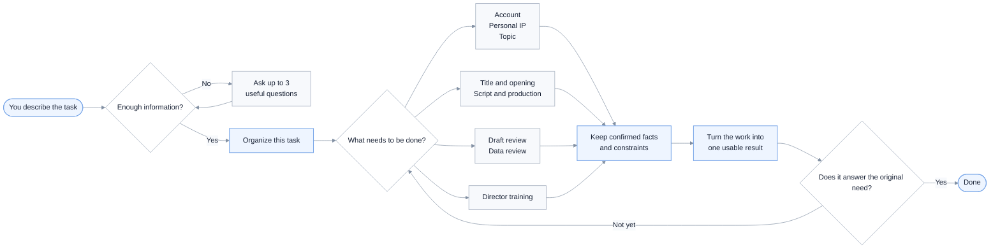

# Human Best Video Director

[简体中文](README.md) | English | [繁體中文](README.zh-TW.md)

A Chinese-first set of director Skills that clarifies the problem before creating the content.

Use it for account positioning, personal IP, topic selection, titles, spoken scripts, production plans, and post-publication reviews. If all you say is “help me start an account,” it will not bury you in generic ideas. It first checks what matters, asks no more than three useful questions, and then continues the work.

Current version: `v1.0.0` · 9 Skills · [CC BY-NC 4.0](LICENSE)

## Start with an example

You can say:

```text
Use $human-best-video-director.

I want to start a faceless Xiaohongshu account about practical AIGC workflows.
My audience is office workers and social media operators. I am good at
commercial execution and content creation. I can record my screen and add voice-over.

Help me position the account, choose the best first topic, and turn it into a 60-second script.
```

You should receive:

1. A clear answer to who the account is for and why someone would follow it.
2. One topic worth publishing first, instead of a long list of loose ideas.
3. A 60-second script you can record and shoot.
4. A list of shots that must be captured and claims that must not be invented.

If your request is only:

```text
I want to start a Xiaohongshu account. Help me get it off the ground.
```

The Skill will not invent your identity or direction. It asks up to three questions that would actually change the plan. Once you answer, it continues from there without restarting the interview or making you type “continue” at every step.

## What can it help with?

| Your situation | What it does |
|---|---|
| You want to start an account but the direction is still vague | Clarifies the three most important unknowns, then proposes one workable direction |
| You know what you are good at but not who the account is for | Defines the audience, the reason to follow, and the first assumption worth testing |
| You want a personal IP without performing a fake persona | Finds the part of your real experience and ability that is worth building around |
| You have too many topic ideas and do not know what to shoot first | Recommends one topic for the current stage and explains why |
| The title is strong but the body does not deliver | Aligns the title, cover, opening, evidence, and payoff |
| You have an idea but cannot turn it into a shootable video | Writes the spoken script, shot order, and missing-footage checklist |
| You are faceless, low-budget, or working alone | Adapts the plan to screen recordings, voice-over, real footage, hands, or source material |
| A post underperformed and you do not know why | Separates what the data proves from what is still a guess, then picks one thing to change |
| You want to improve as a director | Reworks the same real task twice so you can see whether your judgment improved |

## The nine Skills

Most people only need to remember `$human-best-video-director`. If you already know exactly what you need, call a specialist directly.

| Skill | Use it when | What you get |
|---|---|---|
| `$human-best-video-director` | You do not know where to start, or the request spans several stages | It chooses the order and returns one coherent result |
| `$hbvd-intake` | The request is still broad and you are not sure whether the information is sufficient | Up to three useful questions, followed by a handoff to the next step |
| `$hbvd-account` | You need account positioning, a launch plan, or recurring content directions | One account promise, a reason to follow, and a first test to run |
| `$hbvd-ip` | You are building a personal IP, founder presence, or character-led story | What to emphasize, why people should trust it, and how the first story should work |
| `$hbvd-topic` | Several directions seem possible, or you need to decide whether a topic is worth making | One recommended topic, the evidence it needs, and reasons to reject weaker options |
| `$hbvd-hook` | The topic and body exist, but the title, cover, or opening needs work | One title, cover line, opening sentence, and first visual |
| `$hbvd-script` | The topic is confirmed and you are ready to produce | A speakable script, timeline, shot plan, and production checklist |
| `$hbvd-review` | You have a draft, video, or performance data and want to know what failed | The most likely bottleneck, conclusions you cannot yet make, and one change for the next test |
| `$hbvd-training` | You want to train topic judgment, empathy, visual thinking, pacing, or material selection | One real exercise, a rewrite method, and a way to judge improvement |

## How it works



The Skills keep track of facts, materials, and constraints already provided in the conversation. A later specialist continues from that context instead of asking the same questions again.

## Common ways to use it

### Start an account from scratch

```text
Use $human-best-video-director.

I want to create a real-estate content account, but the direction is not clear yet.
I do not want to appear on camera. I can visit properties and record maps and commute data.
Ask only for information that would change the plan, then help me design the launch.
```

### Pick one topic for a new account

```text
Use $hbvd-topic.

This is a new Xiaohongshu account for office workers buying their first home.
I can produce property field tests, but I will not appear on camera.
Recommend only one topic to publish first and tell me what footage I need.
```

### Turn a confirmed topic into a script

```text
Use $hbvd-script.

The topic is: “The sales office says the metro is 800 meters away,
so I walked it at 6:30 p.m. on a Monday.”
The audience is office workers buying their first home. I have maps and real walking footage.
Write a 60-second voice-over, timeline, and shot list.
Leave unknown measurements blank instead of inventing them.
```

### Create a founder story

```text
Use $human-best-video-director.

I run a neighborhood bakery and want local families to understand why we bake everything daily.
I can appear on camera. I have early photos, footage of morning preparation, and the real process.
Find the trust this story should build, then turn it into a shootable video plan.
```

### Improve a title and opening

```text
Use $hbvd-hook.

Here is the finished body and the material I can show: ...
Give me one title, one cover line, the first sentence, and the first visual.
If the body cannot support the promise, tell me directly.
```

### Review an underperforming post

```text
Use $hbvd-review.

The purpose of this post was to earn follows.
Here are the averages from the previous 10 posts, the 72-hour results for this post,
and the title, cover, and full content: ...

Tell me what the evidence supports, what remains unknown, and the one thing to change next.
```

## What information helps?

You do not need to fill out a questionnaire. Share what you know. These details are usually the most useful:

- Platform and whether the account is new or established.
- The person you want to reach and the situation they are in.
- Your real identity, business, experience, or strongest ability.
- What this piece needs to accomplish: reach, follows, trust, sales, or clear expression.
- Real examples, data, locations, recordings, screenshots, or archive material you have.
- Whether you can appear on camera, target length, budget, and available people.
- The result you want: direction, topic, title, full script, or review plan.

For example:

```text
This is a new Xiaohongshu account.
The audience is office workers buying their first home and commuting by metro.
I make faceless field-test content and have a phone, maps, and real footage.
This video should explain what “800 meters from the metro” means during rush hour.
Give me a 60-second voice-over, timeline, and shot list.
```

If you only have one sentence, that is fine. The main Skill will ask about the few things that matter most.

## A few rules that matter

### One recommendation by default

Unless you explicitly ask for a topic bank or several options, it makes a decision first. One idea you can shoot today is often more useful than ten ideas that all look possible.

### No invented experience or results

Unknown numbers stay blank or are marked clearly. Unconfirmed judgments are treated as assumptions. The Skills should not fabricate client feedback, revenue, views, or historical footage.

### The content must deliver the title's promise

The title, cover, first sentence, first visual, and body should all point to the same value. A louder hook should not hide a weak body.

### A script has to be producible

Crew size, camera preference, available footage, budget, and time all change the plan. For faceless content, the Skills prefer real footage, screen recordings, hands, documents, voice-over, and captions.

### A review should admit uncertainty

Poor numbers do not automatically mean throttling or a bad topic. The review separates observed facts from possible explanations, then chooses one major change for the next test.

## Installation

### Codex

This repository is currently private. Use an authorized GitHub account:

```bash
gh auth login
git clone https://github.com/Eliotcute/human-best-video-director.git
cd human-best-video-director

mkdir -p ~/.codex/skills
cp -R human-best-video-director hbvd-* ~/.codex/skills/
```

Open a new Codex task and enter:

```text
Use $human-best-video-director to help me complete this content task.
```

### Claude Code

```bash
mkdir -p ~/.claude/skills
cp -R human-best-video-director hbvd-* ~/.claude/skills/
```

Skill locations can differ by client version or team configuration. Follow the documentation for your current environment.

### Other agents that support `SKILL.md`

Copy the nine Skill folders into that agent's Skill search directory. If the client does not support `$skill-name`, use its own invocation syntax.

### Updating

```bash
cd human-best-video-director
git pull --ff-only
cp -R human-best-video-director hbvd-* ~/.codex/skills/
```

Back up the installed copy first if you have edited it directly.

## Boundaries

- No promises of virality, follower growth, revenue, sales, or platform recommendation.
- No invented identities, experience, cases, data, or testimonials.
- New footage must not be presented as historical footage.
- A guess must not be presented as a conclusion when the evidence is incomplete.
- Explicit constraints such as faceless production, budget, length, and crew size must be respected.
- The Skills do not replace legal, medical, or investment advice.

## Repository layout

```text
human-best-video-director/
├── README.md
├── README.en.md
├── README.zh-TW.md
├── LICENSE
├── human-best-video-director/   # Main router
├── hbvd-intake/                 # Clarify the request
├── hbvd-account/                # Account positioning and launch
├── hbvd-ip/                     # Personal IP and founder stories
├── hbvd-topic/                  # Topic decisions
├── hbvd-hook/                   # Title, cover, and opening
├── hbvd-script/                 # Script and production plan
├── hbvd-review/                 # Draft and data review
└── hbvd-training/               # Director training
```

Each Skill folder contains:

```text
SKILL.md
agents/openai.yaml
```

## License

This project is licensed under [Creative Commons Attribution-NonCommercial 4.0 International](LICENSE).

You may copy, share, and adapt the project with appropriate attribution, but not for commercial purposes. See the [official Creative Commons legal code](https://creativecommons.org/licenses/by-nc/4.0/legalcode) for the full terms.
