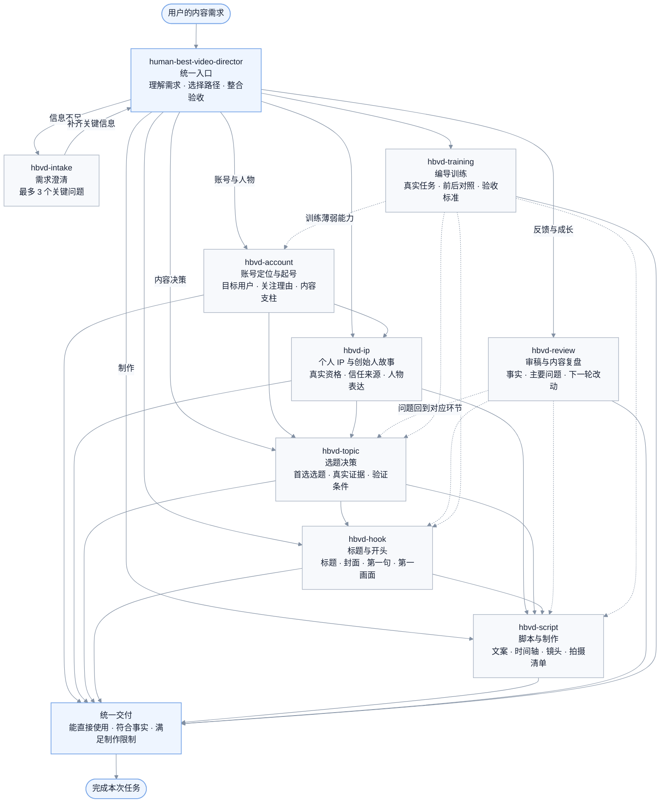
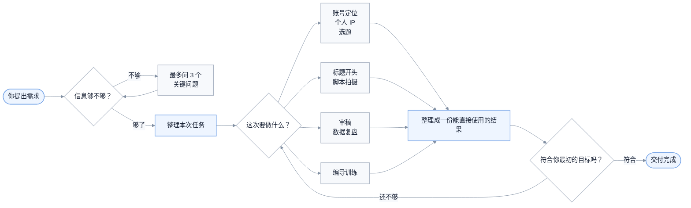

# 人类最强编导

简体中文 | [English](README.en.md) | [繁體中文](README.zh-TW.md)

[](#)
[](https://skills.sh/Eliotcute/human-best-video-director)
[](LICENSE)
[](https://x.com/shizhieliot)

由 [Eliot](https://x.com/shizhieliot) 创建。

一套面向内容创作者、新媒体运营、个人 IP、创始人和小团队的中文编导 Skills。

它处理从“这个账号应该做给谁看”，到“这一条具体怎么拍”，再到“发布后下一条应该改什么”的完整内容链路。你可以用它做账号定位、个人 IP、选题判断、标题与开头、口播稿、拍摄方案和发布复盘。

它不是一个收到主题就立刻生成文案的写作模板。面对模糊需求时，它会先判断目标用户、内容目的、真实素材和制作条件是否足够；缺少的信息确实会改变结果时，最多问三个问题，然后继续完成任务。

当前版本：`v1.1.2` · 9 个 Skills · [CC BY-NC 4.0](LICENSE)

## 适合谁使用

- **内容创作者和博主**：把零散想法做成能发布的选题、开头、文案和拍摄方案。
- **新媒体运营**：为新账号定方向，安排首批内容，并根据真实数据做下一轮调整。
- **个人 IP 和知识型创作者**：从真实经历、能力和观点中找到可以长期表达的内容方向。
- **创始人和品牌负责人**：把产品、业务与创业经历转成用户愿意理解和信任的内容。
- **不出镜或低预算创作者**：根据录屏、实拍、资料、旁白和有限人手设计可执行方案。
- **正在训练编导能力的人**：用真实任务反复练习需求判断、选题、画面、节奏和素材使用。

如果你只想把一句话润色得更顺，普通写作工具已经足够。这个项目更适合需要先判断方向，再把内容真正做出来的人。

## 项目结构

项目由一个统一入口和八个专项 Skill 组成。统一入口负责理解需求、选择本次需要的 Skill、保存已经确认的信息，并把各阶段结果整合成一份最终交付；专项 Skill 各自只处理一个明确问题。



实线表示常见的内容生产顺序，虚线表示复盘或训练后回到具体环节。用户通常只需要使用统一入口，不需要自己安排这八个 Skill 的顺序。

## 先看一个例子

你可以直接这样说：

```text
使用 $human-best-video-director。

我想做一个不出镜的小红书 AIGC 新账号。
用户是普通职场人和新媒体运营，我擅长商业化落地和内容创作，
手里有真实的 AI 工作流，可以录屏和配旁白。

帮我定账号方向，选一条最适合起号的内容，再写成 60 秒脚本。
```

它会直接给你：

1. 这个账号到底做给谁看，为什么值得关注。
2. 现在最应该先发哪一条，而不是列一堆备选。
3. 一份能直接录旁白、照着拍的 60 秒脚本。
4. 哪些画面必须拍到，哪些数据不能乱写。

如果你只说：

```text
我想做一个小红书账号，帮我起号。
```

它不会硬猜你的身份和方向，而是先问最影响方案的三个问题。你回答后，它会接着做，不会重新问一遍，也不需要你反复说“继续”。

## 它能帮你做什么

| 你现在遇到的情况 | 它会怎么帮你 |
|---|---|
| 想做账号，但方向还很模糊 | 问清最关键的三件事，再给出一个能执行的账号方向 |
| 知道自己擅长什么，却说不清账号做给谁看 | 帮你写清目标用户、关注理由，以及最先应该验证什么 |
| 想做个人 IP，但不想硬凹人设 | 从真实经历和能力里找出值得长期讲的那一部分 |
| 手里有很多选题，不知道先拍哪个 | 推荐当前最值得拍的一条，并告诉你为什么是它 |
| 标题很抓人，正文却接不住 | 把标题、封面、开头和正文改成同一个承诺 |
| 有内容想法，但写不成能拍的视频 | 写成完整口播、镜头安排和补拍清单 |
| 不出镜、预算低、只有一个人 | 按你的真实条件改成录屏、旁白、实拍或资料型方案 |
| 发出去数据不好，不知道问题在哪 | 先说哪些是事实，再判断下一条最值得改什么 |
| 想系统提高编导能力 | 用同一个真实任务重做两遍，看看到底有没有进步 |

## 九个 Skills 分别做什么

你通常只需要记住总入口 `$human-best-video-director`。如果已经很清楚自己要什么，也可以直接调用下面的专项 Skill。

| Skill | 适合什么时候用 | 最后会拿到什么 |
|---|---|---|
| `$human-best-video-director` | 不知道该从哪一步开始，或者一次要做完整方案 | 它会自己判断顺序，把最终结果整理成一份完整交付 |
| `$hbvd-intake` | 需求还很泛，不确定信息够不够 | 最多三个关键问题；问清后直接进入下一步 |
| `$hbvd-account` | 要做账号定位、起号或内容栏目 | 一句话账号方向、用户为什么关注、先发什么来验证 |
| `$hbvd-ip` | 要做个人 IP、创始人内容或人物故事 | 这个人该突出什么、靠什么取得信任、第一条怎么讲 |
| `$hbvd-topic` | 有几个方向拿不准，或者想判断某个题值不值得做 | 当前最推荐的一条、需要的素材，以及不该做的理由 |
| `$hbvd-hook` | 选题和正文已经有了，想改标题、封面和开头 | 一个可用标题、封面文案、第一句话和第一画面 |
| `$hbvd-script` | 选题已经定了，准备进入拍摄 | 可直接念的文案、时间轴、镜头安排和拍摄清单 |
| `$hbvd-review` | 有成稿、视频或后台数据，想知道哪里出了问题 | 最可能的卡点、不能乱下的结论，以及下一条只改什么 |
| `$hbvd-training` | 想训练选题、共情、画面感、节奏或素材能力 | 一个真实训练任务、重做方法，以及判断进步的标准 |

## 它是怎么工作的



它会沿用你已经说过的事实、素材和限制，后面的 Skill 不应该重复问同样的问题。

## 常见用法

### 1. 从零开始做一个账号

```text
使用 $human-best-video-director。

我想做一个房产内容账号，但还没想好具体方向。
我不出镜，平时能实地拍楼盘，也有地图和通勤数据。
先判断还缺哪些关键信息，再帮我制定起号方案。
```

### 2. 只选一条最适合起号的内容

```text
使用 $hbvd-topic。

平台是小红书，新账号。
用户是第一次买房的上班族，我能做楼盘实测，但不出镜。
请只推荐一条最适合先发的内容，并告诉我必须准备哪些素材。
```

### 3. 已经有选题，直接写脚本

```text
使用 $hbvd-script。

选题是：“售楼处说离地铁 800 米，我在周一 18:30 实际走一遍”。
用户是第一次买房的上班族。我不出镜，有地图和实地步行录像。
请写一版 60 秒旁白、时间轴和拍摄清单。
未知的实测数字先留空，不要替我编。
```

### 4. 做一条创始人故事

```text
使用 $human-best-video-director。

我经营一家社区烘焙店，想让附近家庭理解我们为什么坚持当天制作。
我可以出镜，有创业初期的照片、每天凌晨备料的录像和真实制作流程。
请帮我找到这条故事真正要建立的信任，再写成能拍的视频方案。
```

### 5. 优化标题和前几秒

```text
使用 $hbvd-hook。

这是已经写好的正文和现有素材：……
请给我一个标题、一句封面文案、第一句话和第一画面。
如果正文接不住标题，也请直接告诉我问题在哪里。
```

### 6. 看一条内容为什么没做好

```text
使用 $hbvd-review。

这条内容的目标是让用户关注账号。
账号最近 10 条的平均数据是……，这条发布 72 小时后的数据是……。
这是标题、封面和完整内容：……

请告诉我目前能确定什么、还不能确定什么，以及下一条最值得只改哪一处。
```

## 回答大概会长什么样

下面是经过压缩的示意片段。真正使用时，回答会根据你的业务、素材和限制重新生成，不会机械套用。

### 信息不够时

你说：

```text
我想做一个地产个人 IP，帮我规划一下。
```

它不会先编一个人设，而会这样问：

```text
现在还不能直接定人物方向，因为你具体做什么业务、想让谁信任你、是否愿意出镜，都会改变内容方案。请告诉我：

1. 你现在主要卖房、做咨询，还是经营地产相关公司？
2. 你最想吸引哪类客户，他们对你或这个行业最不放心什么？
3. 你是否愿意出镜，手里有哪些真实经历、案例或现场素材？
```

### 选起号内容时

你已经说明自己做 AIGC 内容、擅长商业落地、有真实工作流，而且不出镜。它可能会给出：

```text
建议先发：我用 AI 生成了 30 篇小红书笔记，最后只有 4 篇值得发布。

为什么先做这条：
它能同时证明你会用 AI，也能证明你有内容判断，不需要观众先认识你。

拍之前准备：
- 30 篇初稿的真实列表或缩略图
- 你筛掉内容时使用的标准
- 4 篇保留稿的修改前后对照

如果拿不出这些过程证据，就不要把“30 篇”和“4 篇”写进标题。
```

### 写脚本时

针对“售楼处说离地铁 800 米，我在晚高峰实际走一遍”，脚本片段可能是：

```text
0—5 秒
画面：宣传页上的“800 米”切到手机计时结果。
旁白：售楼处说这里离地铁只有 800 米。周一晚上 6 点半，我按上班族真正下班的时间走了一遍，全程用了【实测分钟】分钟。

5—12 秒
画面：楼盘实际出口、地图路线、地铁口编号。
旁白：我从【实际起点】出发，终点不是地图上的地铁图标，而是能真正进站的【地铁口名称】。

必须拍到：开始时间、实际出口、完整路线、红绿灯或绕行点、地铁口编号、停止计时画面。
```

未知的距离、耗时和路线结果会保留占位，等你实测后再填写。

### 复盘数据时

假设你提供了最近 10 条的平均数据、本条数据和完整内容，它会把回答拆清楚：

```text
目前能确定：这条前三秒留存低于账号近期平均值，问题首先出现在进入正文之前。

优先假设：封面承诺的是“真实通勤时间”，第一画面却先介绍楼盘背景，观众没有马上看到实测证据。

目前不能确定：不能仅凭这一条数据判断账号被限流，也不能证明整个房产实测方向无效。

下一条只改一处：第一画面直接放最终计时结果，正文其他部分不变。
```

### 其他专项会给出什么

账号定位不会只写“做一个有温度的 IP”，而会落到一句能执行的话：

```text
账号方向：替第一次买房的上班族实测楼盘宣传中最容易被忽略的通勤和生活成本。
关注理由：每条内容都替用户走一次、算一次、核对一次。
先验证：连续发布 3 条通勤实测，观察用户是否主动询问具体楼盘和路线。
```

人物 IP 会把真实经历和信任目标连起来：

```text
人物重点：不是“成功创业者”，而是每天凌晨亲自确认原料和出炉时间的店主。
信任来源：真实备料过程、失败批次如何处理、为什么坚持当天制作。
第一条故事：一次舍不得报废产品的经历，怎样变成今天的出品标准。
```

标题与开头会给出能互相兑现的一组内容：

```text
标题：售楼处说离地铁 800 米，我在周一晚高峰走了一遍
封面：800 米，到底要走多久？
第一句话：先别看地图上的距离，这是我从楼盘实际出口走到地铁闸机的时间。
第一画面：手机最终计时结果。
```

编导训练会围绕一个真实任务重做，而不是安排“每天刷 100 条视频”：

```text
本轮只练：把抽象用户改成具体使用场景。
原题：给买房人讲地铁距离。
重做要求：分别写出早高峰通勤者、带孩子家庭、夜班工作者最在意的路线问题。
验收：三类用户能否准确说出“这条内容是替我解决什么问题”。
```

## 常见问题

### 第一次用，应该调用哪个 Skill？

直接使用 `$human-best-video-director`。它会根据你这次真正想完成的事情决定从哪一步开始。

### 我只能说出一句模糊需求，也可以用吗？

可以。它最多问三个会改变方案的问题。你不想补充时，也可以说“先按现有信息做”，它会把采用的假设写清楚，只给一个临时版本。

### 为什么有时不直接写，而要先问问题？

因为目标用户、真实素材和制作限制一旦不同，定位、选题和脚本都会变。问题只用于避免替你编背景，不是固定问卷。

### 可以一次要求定位、选题和脚本吗？

可以。只要信息足够，它会在同一轮继续完成；如果某一步缺少会影响后续的事实，才会停下来确认。

### 我已经有选题了，还会重新做账号定位吗？

不会。你明确要求写脚本时，它应直接使用现有选题和上下文，不擅自扩展任务。

### 没有后台数据，能做复盘吗？

可以审稿，但不能假装完成了数据归因。它会检查标题、开头、结构、证据和关注理由，并明确哪些判断仍需要发布数据。

### 回答不符合我的风格，怎么改？

直接指出具体变化，例如“口语一点”“删掉行业术语”“压缩到 45 秒”“保留结构，只重写开头”。不用重新描述全部背景。

### 它会自动查平台热点或替我发布吗？

不会默认连接平台后台、抓取实时数据或代替你发布。你可以把趋势材料、账号数据或平台规则发给它，再让它基于这些内容判断。

## 怎样把需求说清楚

不用填完整问卷。你知道多少就说多少，下面这些信息最有用：

- 发在哪个平台，账号是新的还是已经做了一段时间。
- 想让哪一类人在什么场景下看到内容。
- 你真实的身份、业务、经历或擅长的事。
- 这次最想完成什么：触达、关注、信任、成交，还是单纯把观点讲清楚。
- 手里有哪些真实案例、数据、现场、录屏或历史资料。
- 能不能出镜、准备做多长、预算和人手有多少。
- 最后希望拿到什么：方向、选题、标题、完整稿，还是复盘方案。

例如：

```text
平台是小红书，全新账号。
用户是第一次买房、每天坐地铁通勤的上班族。
我做不出镜的房产实测内容，有手机、地图和现场录像。
这条要帮用户判断“地铁 800 米”在晚高峰到底意味着什么。
请给我一版 60 秒旁白、时间轴和拍摄清单。
```

如果你的需求只有一句话也没关系。总入口会先问最影响结果的问题，而不是给你发一张长问卷。

## 几条重要原则

### 默认只给一个最推荐的方案

除非你明确要选题库或多方案比较，否则它会先帮你做决定。十个看起来都能做的选题，通常不如一条现在就能拍的内容有用。

### 不替你编经历和结果

不知道的数据会留空或标出来，不能确认的判断会说明是假设。它不会替你虚构客户反馈、收入、播放量或历史现场。

### 标题必须由正文兑现

标题、封面、第一句话、第一画面和正文要讲同一件事。正文没有价值时，不会靠更夸张的标题把问题盖过去。

### 脚本要考虑你是否真的拍得出来

有没有人手、愿不愿意出镜、能拍到什么、预算多少，都会影响方案。不出镜时，会优先使用实拍、录屏、手部、资料、旁白和字幕。

### 复盘时先承认不知道

一条内容数据不好，不等于被限流，也不一定是选题错了。它会把已经发生的事实和暂时的猜测分开，再决定下一条只改一个主要地方。

## 安装

### skills.sh

仓库公开后，可以通过官方 Skills CLI 直接安装。运行命令后，按提示选择需要的 Skill 和 Agent：

```bash
npx -y skills add Eliotcute/human-best-video-director -g
```

`-g` 表示安装到当前用户的全局 Skills 目录，不会在仓库里生成 `.agents/` 和 `skills-lock.json`。

也可以先只查看仓库中可用的 Skill，不执行安装：

```bash
npx -y skills add Eliotcute/human-best-video-director --list
```

### Codex

仓库已公开，可以直接获取代码：

```bash
gh auth login
git clone https://github.com/Eliotcute/human-best-video-director.git
cd human-best-video-director

mkdir -p ~/.codex/skills
cp -R human-best-video-director hbvd-* ~/.codex/skills/
```

重新打开一个 Codex 任务，然后输入：

```text
使用 $human-best-video-director，帮我完成这次内容任务。
```

### Claude Code

```bash
mkdir -p ~/.claude/skills
cp -R human-best-video-director hbvd-* ~/.claude/skills/
```

Claude Code 原生使用 `SKILL.md`。九个目录一起安装后，系统才能根据你的问题选择正确的功能。不同版本或团队配置可能使用不同的 Skills 目录，请以当前客户端说明为准。

### 豆包

豆包电脑端具备自己的 `.skills` 工作区机制，文件格式同样以 `SKILL.md` 为核心。不要只导入“人类最强编导”：必须让九个 Skill 都出现在豆包的 Skills 目录或“规则和技能”列表中，否则账号定位、选题、脚本等功能可能无法被正确使用。

豆包版本和工作区形态更新较快，本仓库暂不写死本机目录。通过 SkillHub 安装后，请先确认列表中是否能看到 `human-best-video-director` 与八个 `hbvd-*` Skill；如果只看到一个，请把九个目录分别导入。

### TRAE

TRAE 支持项目级 `.trae/skills`。可把九个 Skill 目录放进当前项目：

```bash
mkdir -p .trae/skills
cp -R human-best-video-director hbvd-* .trae/skills/
```

然后在 TRAE 的“规则和技能”中检查九个 Skill 是否都能看到。TRAE 的使用方式可能与 Codex 的 `$skill-name` 不同，请按当前版本显示的方式调用。如果只看到一个 Skill，账号定位、选题和脚本等功能之间可能无法自动衔接。

### 兼容性怎么判断

| 环境 | 当前判断 | 使用前检查 |
|---|---|---|
| Codex | 完整适配，已作为主要测试环境 | 九个 Skill 均出现在可用列表 |
| Claude Code | 完整适配 `SKILL.md` 与多 Skill 安装 | 九个目录一起复制到 Skills 目录 |
| 豆包电脑端 | 支持同类文件格式；安装方式随版本变化 | 列表中能看到全部九个 Skill |
| TRAE | 支持 `.trae/skills`，具体使用方式随版本变化 | 列表中能看到全部九个 Skill，再测试一次起号或脚本任务 |
| 普通聊天模型 | 只能把内容当提示词或知识文件使用 | 不会自动选择和衔接九个 Skill |

### 其他支持 `SKILL.md` 的 Agent

把仓库中的九个 Skill 文件夹复制到该 Agent 的 Skills 目录。安装后确认九个 Skill 都能看到，并用一次完整任务检查它能否从需求澄清继续做到选题或脚本。如果客户端不支持 `$skill-name` 语法，请使用它自己的调用方式。

### 更新

```bash
cd human-best-video-director
git pull --ff-only
cp -R human-best-video-director hbvd-* ~/.codex/skills/
```

如果你曾经直接修改过安装目录里的文件，更新前请先备份。

## 使用边界

- 不承诺爆款、涨粉、收入、成交或平台推荐。
- 不虚构身份、经历、案例、数据和用户评价。
- 没有真实素材时，不把补拍画面冒充历史现场。
- 数据不够时，不把猜测写成确定结论。
- 不忽略你明确提出的不出镜、预算、时长和人员限制。
- 不替代法律、医疗、投资等专业意见。

## 项目结构

```text
human-best-video-director/
├── README.md
├── LICENSE
├── human-best-video-director/   # 总入口
├── hbvd-intake/                 # 先把需求问清楚
├── hbvd-account/                # 账号定位与起号
├── hbvd-ip/                     # 个人 IP 与创始人故事
├── hbvd-topic/                  # 选题判断
├── hbvd-hook/                   # 标题、封面与开头
├── hbvd-script/                 # 文案与拍摄方案
├── hbvd-review/                 # 内容审稿与数据复盘
└── hbvd-training/               # 编导能力训练
```

每个 Skill 目录都包含：

```text
SKILL.md
agents/openai.yaml
```

## 许可协议

本项目采用 [Creative Commons Attribution-NonCommercial 4.0 International](LICENSE) 许可协议。

你可以在保留适当署名的前提下复制、分享和改编本项目，但不得用于商业用途。完整法律条款以 [Creative Commons 官方协议](https://creativecommons.org/licenses/by-nc/4.0/legalcode) 为准。
