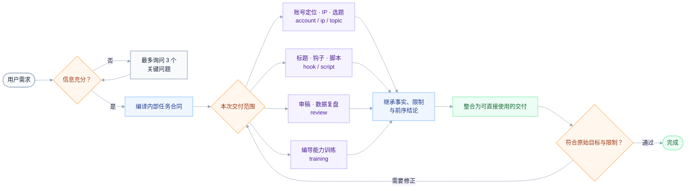

# 人类最强编导


[](LICENSE)

面向短视频创作者、个人 IP、品牌主理人和新媒体运营的中文 Agent Skills。

它不会在用户刚说“帮我起号”时立刻生成几十个选题，而是先判断真实目标、目标用户、账号阶段、可用素材和生产限制，再把需求整理成可执行任务，调用对应的专项 Skill 完成交付。

支持的主要工作包括：账号定位与起号、IP 与创始人故事、选题决策、标题与开头、口播与图文脚本、拍摄方案、内容审稿、数据复盘和编导训练。

> 已在 Codex 中完成结构校验、行为门禁和真实任务前向测试。其他支持 `SKILL.md` 规范的 Agent 可按各自的 Skills 目录安装使用。

## 导航

- [它解决什么问题](#它解决什么问题)
- [快速开始](#快速开始)
- [常见任务](#常见任务)
- [能力一览](#能力一览)
- [工作方式](#工作方式)
- [安装](#安装)
- [完整使用手册](#完整使用手册)
- [怎样提供有效输入](#怎样提供有效输入)
- [输出原则](#输出原则)
- [使用边界](#使用边界)
- [项目结构](#项目结构)
- [版本状态](#版本状态)
- [许可协议](#许可协议)

## 它解决什么问题

很多内容工具直接从“生成”开始，但真正影响结果的通常不是文案数量，而是任务有没有判断正确：内容服务谁、这条作品承担什么使命、创作者有什么真实材料、承诺能否被证明、方案是否真的拍得出来。

人类最强编导先处理这些判断，再进入具体创作。

| 真实处境 | 你会得到 |
|---|---|
| 想做一个账号，但只知道大概方向 | 最多三个关键问题、一个首选定位、关注理由和起号验证方案 |
| 账号方向很多，不知道先做哪一个 | 基于用户、证据、账号阶段和产能选择一个首选方向 |
| 想做个人 IP，却容易变成空泛人设 | 从真实身份、经历、能力和用户信任障碍中建立人物定位 |
| 有很多选题，但不知道哪条值得先拍 | 选题硬门槛、优先级判断、证据要求和发布验证信号 |
| 标题很刺激，正文却接不住 | 标题、封面、第一画面、正文推进与最终回报的兑现闭环 |
| 有想法，却写不成能直接拍的内容 | 完整口播或图文稿、镜头安排、证据素材和拍摄清单 |
| 不愿出镜、预算低或人手不足 | 根据真实限制改造成录屏、旁白、实拍、手部或资料型方案 |
| 内容数据不好，不知道问题在哪里 | 事实、假设与不能下的结论，以及只修改一个变量的验证实验 |
| 学了很多方法，实际编导能力没有提升 | 使用真实任务、前后对照和用户复述进行专项训练 |

## 快速开始

安装后，在 Agent 中直接调用总入口：

```text
使用 $human-best-video-director。

我准备做一个不出镜的小红书 AIGC 新账号，目标用户是普通职场人和新媒体运营。
我擅长商业化落地和内容创作，有真实 AI 工作流，可以录屏和配旁白。
请给我一个账号定位、一个首选起号选题和一份可直接拍摄的 60 秒脚本。
```

总入口会判断信息是否充分：

- 信息不足：只询问最多三个会改变方案的问题。
- 信息充分：直接执行，不重复问诊。
- 用户要求多个连续交付：在同一轮完成所需步骤，不要求反复输入“继续”。
- 用户只要一个单点结果：执行到对应阶段即停止，不擅自扩大范围。

如果已经明确知道自己需要什么，也可以直接调用专项 Skill：

```text
使用 $hbvd-topic，从这三个方向中选择一个最适合新账号先做的选题。
```

```text
使用 $hbvd-script，把这个已确认选题写成一份不出镜的 60 秒口播与拍摄方案。
```

```text
使用 $hbvd-review，根据这条内容和后台数据设计下一轮单变量测试。
```

## 常见任务

### 1. 从泛化需求开始起号

```text
使用 $human-best-video-director。我想做一个小红书账号，但还没想清楚定位。先判断真正需要确认的问题，再给我起号方案。
```

预期行为：先确认会改变定位的关键信息，不立即抛出大量赛道和选题。

### 2. 已知优势，选择一个起号选题

```text
使用 $human-best-video-director。
平台是小红书，新账号；目标用户是普通职场人和新媒体运营。
我的优势是商业化落地和内容创作，不愿意出镜。
请只选择一个最容易验证定位的首发选题，并说明需要什么真实证据。
```

预期行为：只给一个首选题，说明为什么现在优先、怎样制作以及什么情况下不应执行。

### 3. 房产实测内容

```text
使用 $human-best-video-director。
小红书新账号，受众是第一次买房的上班族。
选题已经确定：“售楼处说离地铁 800 米，我在周一 18:30 实际走一遍”。
我不出镜，有手机地图和实地步行录像。请写一版 60 秒旁白和拍摄清单。
```

预期行为：直接进入脚本，不重新询问账号定位；未知实测数字保留现场填写，不虚构结果。

### 4. 创始人故事

```text
使用 $human-best-video-director。
我经营一家社区烘焙店，目标是让附近家庭理解我们为什么坚持当天制作。
我可以出镜，有创业初期的照片、每天凌晨备料的录像和真实产品流程。
请先判断故事应该服务什么信任目标，再完成一条创始人故事方案。
```

预期行为：故事围绕用户信任与产品选择展开，不把经历堆砌成个人传记。

### 5. 优化标题和开头

```text
使用 $hbvd-hook。
这是已经完成的选题、正文和证据素材：……
请设计一个标题、封面、第一句话和第一画面，并检查正文能否兑现承诺。
```

预期行为：先检查正文价值和证据；正文接不住时，不用夸张悬念掩盖问题。

### 6. 发布后数据复盘

```text
使用 $hbvd-review。
本条目标是获得关注；账号最近 10 条平均播放为……；本条发布 72 小时的数据为……；
同期发生的变化包括……；这是标题、封面和完整内容：……
请区分事实、主要假设和不能下的结论，并设计下一轮实验。
```

预期行为：只选择一个主要变量测试，不把孤立数据直接归因于限流、选题或平台。

## 能力一览

| 工作目标 | 主要入口 | 常见产出 |
|---|---|---|
| 不知道需求是否足够明确 | `$human-best-video-director`、`$hbvd-intake` | 关键问题、结构化任务、执行顺序 |
| 确定账号定位与起号方式 | `$hbvd-account` | 首选定位、关注理由、内容支柱、最小实验 |
| 建立人物 IP 或创始人故事 | `$hbvd-ip` | 人物定位、信任证据、识别方式、故事结构 |
| 选择当前最值得做的内容 | `$hbvd-topic` | 首选选题、淘汰依据、证据要求、验证信号 |
| 设计标题、封面和开头 | `$hbvd-hook` | 首选标题、首屏、第一句话、第一画面、兑现链路 |
| 生成可直接制作的内容 | `$hbvd-script` | 逐字稿、图文页、镜头、声音、素材与拍摄清单 |
| 审稿或分析发布数据 | `$hbvd-review` | 核心症状、主要假设、证据边界、单变量实验 |
| 训练编导能力 | `$hbvd-training` | 单项训练任务、前后对照、验收与停止条件 |

## 工作方式



内部任务合同用于在多个 Skill 之间传递上下文，默认不会展示给用户。它保存原始目标、交付物、目标用户、平台与账号阶段、已确认的事实和素材、生产限制、尚未确认的假设，以及本次任务的验收标准。

专项 Skill 读取同一份上下文，不应反复询问用户已经回答过的信息。

## 安装

### 1. 获取仓库

当前仓库为私有仓库，需要先使用获授权的 GitHub 账号登录：

```bash
gh auth login
git clone https://github.com/Eliotcute/human-best-video-director.git
cd human-best-video-director
```

### 2. 安装到 Codex

```bash
mkdir -p ~/.codex/skills
cp -R human-best-video-director hbvd-* ~/.codex/skills/
```

重新打开一个 Codex 任务后，输入：

```text
使用 $human-best-video-director，先判断我的真实需求，再帮我完成这次内容任务。
```

### 3. 安装到 Claude Code

Claude Code 使用用户级 Skills 目录时：

```bash
mkdir -p ~/.claude/skills
cp -R human-best-video-director hbvd-* ~/.claude/skills/
```

不同版本或团队环境的 Skills 路径可能不同，请以当前客户端文档和项目配置为准。

### 4. 其他支持 `SKILL.md` 的 Agent

将以下九个目录复制到该 Agent 的 Skills 搜索目录：

```text
human-best-video-director、hbvd-intake、hbvd-account、hbvd-ip、hbvd-topic、
hbvd-hook、hbvd-script、hbvd-review、hbvd-training
```

如果客户端不支持 `$skill-name` 语法，请使用该客户端规定的 Skill 调用方式。

### 更新

进入本地仓库拉取最新版本，然后重新复制九个 Skill 目录：

```bash
cd human-best-video-director
git pull --ff-only
cp -R human-best-video-director hbvd-* ~/.codex/skills/
```

更新前如果修改过已安装目录中的 Skill，请先备份；复制会合并同名目录中的文件。

## 完整使用手册

### `$human-best-video-director`：总入口

适合：不知道该调用哪个 Skill、需求比较泛、或本次请求包含多个连续阶段。

它负责：

1. 读取整段对话中已经提供的信息。
2. 判断是否缺少会改变方案的关键事实。
3. 将需求整理成内部任务合同。
4. 选择完成本次交付所需的专项 Skill。
5. 继承每个阶段的关键结论。
6. 把多阶段结果整合为一个连贯交付。
7. 对照用户原始目标和限制进行最终验收。

推荐输入：

```text
使用 $human-best-video-director。
我的平台是……，账号阶段是……，希望服务……。
我这次最想完成……，拥有的真实材料是……。
制作限制是……，希望最终得到……。
```

### `$hbvd-intake`：需求诊断与任务编译

适合：首次沟通、需求泛化、信息不足，或希望先判断问题是否说清楚。

重点检查：

- 真实身份或业务
- 内容服务的用户与具体场景
- 平台和账号阶段
- 本次作品或账号的主要使命
- 可使用的真实材料与证据
- 出镜、时长、预算、人员和生产频率限制
- 用户真正需要的交付物

它不会在信息不足时顺手附赠一堆选题或半成品方案。

### `$hbvd-account`：账号定位与起号

适合：账号定位、赛道选择、关注理由、内容支柱和起号实验。

常见输入：创作者身份、业务、目标用户、平台、账号阶段、商业目标、素材与产能。

常见产出：

- 一句首选定位
- 定位成立的真实资格
- 用户持续关注的理由
- 默认两个、最多三个内容支柱
- 匹配现有产能的主内容形式
- 第一轮最小验证实验
- 定位不成立或需要调整的信号

### `$hbvd-ip`：IP 与创始人故事

适合：人物定位、个人 IP、创始人表达、信任内容和人物故事。

它不会凭空设计人格，而是从真实身份、经历、能力、选择、失败、做事方式和用户疑虑中选择最值得持续强化的部分。

常见产出：人物核心、信任证据、稳定识别方式、触达/信任/转化内容职责，以及一条首选起步内容。

### `$hbvd-topic`：选题决策

适合：选择选题、比较方向、判断某个题值不值得做，或在明确要求时生成选题库。

候选选题会经过以下检查：

- 用户和场景是否具体
- 创作者是否有真实表达资格
- 核心承诺能否被画面、数据、案例或过程证明
- 是否符合当前账号阶段和作品使命
- 是否匹配时间、预算、出镜意愿和素材条件
- 发布后能否验证核心假设

默认只输出一个首选题。要求比较时最多给三个，并明确推荐一个。

### `$hbvd-hook`：钩子与内容承诺

适合：标题、封面、首屏、第一句话和第一画面。

核心链路：

```text
用户具体问题
→ 标题与封面承诺
→ 第一画面证据
→ 正文持续推进
→ 明确结果
→ 后续关注价值
```

如果正文没有真正价值、承诺没有证据或标题与结果不一致，它会先指出根本问题，而不是继续制造更刺激的开头。

### `$hbvd-script`：脚本与制作

适合：口播逐字稿、图文结构、Vlog、短片、镜头设计和制作方案。

常见产出：

- 标题与封面方向
- 一句话内容承诺
- 按时间或图文页拆分的结构
- 完整口播或页面文案
- 画面与声音分工
- 必须拍到的证据镜头
- 可替代素材
- 人物、场景、道具与声音清单
- 制作复杂度与真实性风险
- 发布后的验证方式

不出镜时，会优先考虑实拍现场、录屏、手部、资料、产品过程、旁白和字幕，不会默认要求真人正脸口播。

### `$hbvd-review`：内容审稿与数据复盘

适合：成稿审查、结构诊断、发布数据分析和下一轮测试。

它会明确区分：

- **已知事实**：用户提供的数据、内容和明确变化
- **主要假设**：能够解释事实但尚未证明的原因
- **不能下的结论**：缺少基线、对照、周期或来源时不能断言的内容

每轮只选择一个主要变量修改，并提前写明核心假设、主要指标、守门指标、观察周期和判断规则。

### `$hbvd-training`：编导能力训练

适合：训练用户需求感知、热点判断、共情、画面想象、表达节奏和素材调用能力。

训练以真实任务为基础：保留第一次输出，只改变一个训练变量，再用同一任务重做并比较前后版本。成功标准不是收藏了多少案例，而是判断是否更具体、证据是否更充分、画面与台词是否更匹配，以及目标用户能否准确复述。

## 怎样提供有效输入

不需要一次填写完整问卷。优先提供会真正改变方案的信息：

```text
平台与账号阶段：
目标用户与具体场景：
我的真实身份、业务或能力：
本次最想完成的目标：
已经确认的选题或内容：
可使用的真实案例、数据、素材或现场：
不出镜、时长、预算、人员等制作限制：
希望得到的具体交付物：
```

一个有效输入示例：

```text
平台是小红书，全新账号。
用户是第一次买房、每天坐地铁通勤的上班族。
我做不出镜的房产实测内容，有手机、地图和现场录像。
本条要帮助用户判断“地铁 800 米”在晚高峰真实意味着什么。
请给我一版 60 秒旁白、时间轴和拍摄清单。
未知的实测数字先保留占位，不要替我编。
```

如果只知道一个大概方向，也可以直接说。总入口会优先询问影响最大的三个问题。

## 输出原则

### 1. 先判断，再生成

不会把生成数量当作完成任务。默认只交付一个首选方案，并解释为什么现在优先。

### 2. 事实、假设和外部经验分离

用户确认的事实不会与模型推断混写。无法确认的内容会标记为假设、占位或外部执行适配。

### 3. 钩子必须兑现

标题、封面、开头、第一画面和正文围绕同一个承诺，不能用悬念掩盖内容不足。

### 4. 文案必须能够生产

脚本会同时考虑素材、人员、场景、设备、预算、时长和出镜意愿，而不只追求文字效果。

### 5. 复盘必须能够验证

数据诊断不自动归因限流，也不会同时修改多个关键变量后宣称找到原因。

### 6. 最终结果回到用户原始目标

多 Skill 协作的最终输出会整合为一个完整结果，不默认展示内部 Skill 名称、路由过程或任务合同。

## 使用边界

- 不虚构身份、经历、案例、数据、权威和用户评价
- 不承诺爆款、涨粉、收入、成交或平台推荐结果
- 不用标题技巧代替正文价值和真实证据
- 不把一次孤立数据直接写成确定因果
- 不在缺少真实素材时伪造历史现场或结果证明
- 不忽略用户明确的不出镜、预算、时长、人员和设备限制
- 不把平台经验写成永久不变的规则
- 不替代法律、医疗、投资等专业审查

## 项目结构

```text
human-best-video-director/
├── README.md
├── human-best-video-director/       # 总入口：需求编译、路由与验收
│   ├── SKILL.md
│   └── agents/openai.yaml
├── hbvd-intake/                     # 需求诊断与任务编译
├── hbvd-account/                    # 账号定位与起号
├── hbvd-ip/                         # IP 与创始人故事
├── hbvd-topic/                      # 选题决策
├── hbvd-hook/                       # 钩子与内容承诺
├── hbvd-script/                     # 脚本与制作
├── hbvd-review/                     # 审稿与数据复盘
└── hbvd-training/                   # 编导能力训练
```

每个专项 Skill 都包含标准入口和 Agent 展示元数据：

```text
SKILL.md
agents/openai.yaml
```

目录名与 `SKILL.md` 中的 `name` 决定调用名称，例如：

```text
hbvd-topic/SKILL.md   → $hbvd-topic
hbvd-script/SKILL.md  → $hbvd-script
```

## 版本状态

当前版本：`v1.0.0`

当前包含 1 个需求编译与路由总入口、8 个专项 Skill，以及账号、IP、选题、钩子、脚本、复盘和训练完整链路。已覆盖泛化需求、信息充分、多阶段交付与异常输入，并完成自动化结构、行为校验和真实内容任务前向测试。

该版本可以用于正式任务。内容效果仍应结合具体账号、真实素材、发布数据和长期复盘持续验证。

## 许可协议

本项目采用 [Creative Commons Attribution-NonCommercial 4.0 International](LICENSE) 许可协议。

你可以在遵守协议的前提下复制、分享和改编本项目，但必须保留适当署名，且不得用于商业用途。完整法律条款以 [Creative Commons 官方协议](https://creativecommons.org/licenses/by-nc/4.0/legalcode) 为准。
