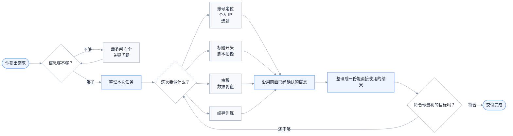

# 人类最强编导

简体中文 | [English](README.en.md) | [繁體中文](README.zh-TW.md)

一个先把问题问清楚，再帮你把内容做出来的中文编导 Skills。

你可以拿它做账号定位、个人 IP、选题、标题、口播稿、拍摄方案和发布复盘。它不会在你刚说“我想做个账号”时，马上扔给你几十个选题；它会先看看还缺什么关键信息，最多问三个问题，然后继续往下做。

当前版本：`v1.0.0` · 9 个 Skills · [CC BY-NC 4.0](LICENSE)

## 先看一个例子

你可以直接这样说：

```text
使用 $human-best-video-director。

我想做一个不出镜的小红书 AIGC 新账号。
用户是普通职场人和新媒体运营，我擅长商业化落地和内容创作，
手里有真实的 AI 工作流，可以录屏和配旁白。

帮我定账号方向，选一条最适合起号的内容，再写成 60 秒脚本。
```

它会直接给你：

1. 这个账号到底做给谁看，为什么值得关注。
2. 现在最应该先发哪一条，而不是列一堆备选。
3. 一份能直接录旁白、照着拍的 60 秒脚本。
4. 哪些画面必须拍到，哪些数据不能乱写。

如果你只说：

```text
我想做一个小红书账号，帮我起号。
```

它不会硬猜你的身份和方向，而是先问最影响方案的三个问题。你回答后，它会接着做，不会重新问一遍，也不需要你反复说“继续”。

## 它能帮你做什么

| 你现在遇到的情况 | 它会怎么帮你 |
|---|---|
| 想做账号，但方向还很模糊 | 问清最关键的三件事，再给出一个能执行的账号方向 |
| 知道自己擅长什么，却说不清账号做给谁看 | 帮你写清目标用户、关注理由，以及最先应该验证什么 |
| 想做个人 IP，但不想硬凹人设 | 从真实经历和能力里找出值得长期讲的那一部分 |
| 手里有很多选题，不知道先拍哪个 | 推荐当前最值得拍的一条，并告诉你为什么是它 |
| 标题很抓人，正文却接不住 | 把标题、封面、开头和正文改成同一个承诺 |
| 有内容想法，但写不成能拍的视频 | 写成完整口播、镜头安排和补拍清单 |
| 不出镜、预算低、只有一个人 | 按你的真实条件改成录屏、旁白、实拍或资料型方案 |
| 发出去数据不好，不知道问题在哪 | 先说哪些是事实，再判断下一条最值得改什么 |
| 想系统提高编导能力 | 用同一个真实任务重做两遍，看看到底有没有进步 |

## 九个 Skills 分别做什么

你通常只需要记住总入口 `$human-best-video-director`。如果已经很清楚自己要什么，也可以直接调用下面的专项 Skill。

| Skill | 适合什么时候用 | 最后会拿到什么 |
|---|---|---|
| `$human-best-video-director` | 不知道该从哪一步开始，或者一次要做完整方案 | 它会自己判断顺序，把最终结果整理成一份完整交付 |
| `$hbvd-intake` | 需求还很泛，不确定信息够不够 | 最多三个关键问题；问清后直接进入下一步 |
| `$hbvd-account` | 要做账号定位、起号或内容栏目 | 一句话账号方向、用户为什么关注、先发什么来验证 |
| `$hbvd-ip` | 要做个人 IP、创始人内容或人物故事 | 这个人该突出什么、靠什么取得信任、第一条怎么讲 |
| `$hbvd-topic` | 有几个方向拿不准，或者想判断某个题值不值得做 | 当前最推荐的一条、需要的素材，以及不该做的理由 |
| `$hbvd-hook` | 选题和正文已经有了，想改标题、封面和开头 | 一个可用标题、封面文案、第一句话和第一画面 |
| `$hbvd-script` | 选题已经定了，准备进入拍摄 | 可直接念的文案、时间轴、镜头安排和拍摄清单 |
| `$hbvd-review` | 有成稿、视频或后台数据，想知道哪里出了问题 | 最可能的卡点、不能乱下的结论，以及下一条只改什么 |
| `$hbvd-training` | 想训练选题、共情、画面感、节奏或素材能力 | 一个真实训练任务、重做方法，以及判断进步的标准 |

## 它是怎么工作的



简单来说，它会在内部记住你已经说过的事实、素材和限制。后面的 Skill 直接接着这些信息工作，不应该重复问你同样的问题。

## 常见用法

### 1. 从零开始做一个账号

```text
使用 $human-best-video-director。

我想做一个房产内容账号，但还没想好具体方向。
我不出镜，平时能实地拍楼盘，也有地图和通勤数据。
先判断还缺哪些关键信息，再帮我制定起号方案。
```

### 2. 只选一条最适合起号的内容

```text
使用 $hbvd-topic。

平台是小红书，新账号。
用户是第一次买房的上班族，我能做楼盘实测，但不出镜。
请只推荐一条最适合先发的内容，并告诉我必须准备哪些素材。
```

### 3. 已经有选题，直接写脚本

```text
使用 $hbvd-script。

选题是：“售楼处说离地铁 800 米，我在周一 18:30 实际走一遍”。
用户是第一次买房的上班族。我不出镜，有地图和实地步行录像。
请写一版 60 秒旁白、时间轴和拍摄清单。
未知的实测数字先留空，不要替我编。
```

### 4. 做一条创始人故事

```text
使用 $human-best-video-director。

我经营一家社区烘焙店，想让附近家庭理解我们为什么坚持当天制作。
我可以出镜，有创业初期的照片、每天凌晨备料的录像和真实制作流程。
请帮我找到这条故事真正要建立的信任，再写成能拍的视频方案。
```

### 5. 优化标题和前几秒

```text
使用 $hbvd-hook。

这是已经写好的正文和现有素材：……
请给我一个标题、一句封面文案、第一句话和第一画面。
如果正文接不住标题，也请直接告诉我问题在哪里。
```

### 6. 看一条内容为什么没做好

```text
使用 $hbvd-review。

这条内容的目标是让用户关注账号。
账号最近 10 条的平均数据是……，这条发布 72 小时后的数据是……。
这是标题、封面和完整内容：……

请告诉我目前能确定什么、还不能确定什么，以及下一条最值得只改哪一处。
```

## 怎样把需求说清楚

不用填完整问卷。你知道多少就说多少，下面这些信息最有用：

- 发在哪个平台，账号是新的还是已经做了一段时间。
- 想让哪一类人在什么场景下看到内容。
- 你真实的身份、业务、经历或擅长的事。
- 这次最想完成什么：触达、关注、信任、成交，还是单纯把观点讲清楚。
- 手里有哪些真实案例、数据、现场、录屏或历史资料。
- 能不能出镜、准备做多长、预算和人手有多少。
- 最后希望拿到什么：方向、选题、标题、完整稿，还是复盘方案。

例如：

```text
平台是小红书，全新账号。
用户是第一次买房、每天坐地铁通勤的上班族。
我做不出镜的房产实测内容，有手机、地图和现场录像。
这条要帮用户判断“地铁 800 米”在晚高峰到底意味着什么。
请给我一版 60 秒旁白、时间轴和拍摄清单。
```

如果你的需求只有一句话也没关系。总入口会先问最影响结果的问题，而不是给你发一张长问卷。

## 几条重要原则

### 默认只给一个最推荐的方案

除非你明确要选题库或多方案比较，否则它会先帮你做决定。十个看起来都能做的选题，通常不如一条现在就能拍的内容有用。

### 不替你编经历和结果

不知道的数据会留空或标出来，不能确认的判断会说明是假设。它不会替你虚构客户反馈、收入、播放量或历史现场。

### 标题必须由正文兑现

标题、封面、第一句话、第一画面和正文要讲同一件事。正文没有价值时，不会靠更夸张的标题把问题盖过去。

### 脚本要考虑你是否真的拍得出来

有没有人手、愿不愿意出镜、能拍到什么、预算多少，都会影响方案。不出镜时，会优先使用实拍、录屏、手部、资料、旁白和字幕。

### 复盘时先承认不知道

一条内容数据不好，不等于被限流，也不一定是选题错了。它会把已经发生的事实和暂时的猜测分开，再决定下一条只改一个主要地方。

## 安装

### Codex

当前仓库为私有仓库，请先使用有权限的 GitHub 账号获取代码：

```bash
gh auth login
git clone https://github.com/Eliotcute/human-best-video-director.git
cd human-best-video-director

mkdir -p ~/.codex/skills
cp -R human-best-video-director hbvd-* ~/.codex/skills/
```

重新打开一个 Codex 任务，然后输入：

```text
使用 $human-best-video-director，帮我完成这次内容任务。
```

### Claude Code

```bash
mkdir -p ~/.claude/skills
cp -R human-best-video-director hbvd-* ~/.claude/skills/
```

不同版本或团队配置可能使用不同的 Skills 目录，请以当前客户端说明为准。

### 其他支持 `SKILL.md` 的 Agent

把仓库中的九个 Skill 文件夹复制到该 Agent 的 Skills 搜索目录。如果客户端不支持 `$skill-name` 语法，请使用它自己的调用方式。

### 更新

```bash
cd human-best-video-director
git pull --ff-only
cp -R human-best-video-director hbvd-* ~/.codex/skills/
```

如果你曾经直接修改过安装目录里的文件，更新前请先备份。

## 使用边界

- 不承诺爆款、涨粉、收入、成交或平台推荐。
- 不虚构身份、经历、案例、数据和用户评价。
- 没有真实素材时，不把补拍画面冒充历史现场。
- 数据不够时，不把猜测写成确定结论。
- 不忽略你明确提出的不出镜、预算、时长和人员限制。
- 不替代法律、医疗、投资等专业意见。

## 项目结构

```text
human-best-video-director/
├── README.md
├── LICENSE
├── human-best-video-director/   # 总入口
├── hbvd-intake/                 # 先把需求问清楚
├── hbvd-account/                # 账号定位与起号
├── hbvd-ip/                     # 个人 IP 与创始人故事
├── hbvd-topic/                  # 选题判断
├── hbvd-hook/                   # 标题、封面与开头
├── hbvd-script/                 # 文案与拍摄方案
├── hbvd-review/                 # 内容审稿与数据复盘
└── hbvd-training/               # 编导能力训练
```

每个 Skill 目录都包含：

```text
SKILL.md
agents/openai.yaml
```

## 许可协议

本项目采用 [Creative Commons Attribution-NonCommercial 4.0 International](LICENSE) 许可协议。

你可以在保留适当署名的前提下复制、分享和改编本项目，但不得用于商业用途。完整法律条款以 [Creative Commons 官方协议](https://creativecommons.org/licenses/by-nc/4.0/legalcode) 为准。
