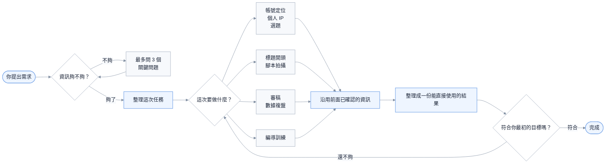

# 人類最強編導

[简体中文](README.md) | [English](README.en.md) | 繁體中文

一套先把問題問清楚，再幫你把內容做出來的中文編導 Skills。

你可以用它做帳號定位、個人 IP、選題、標題、口播稿、拍攝方案和發布後複盤。它不會在你剛說「我想做個帳號」時，立刻丟給你幾十個選題；它會先看看還缺哪些關鍵資訊，最多問三個問題，然後繼續往下做。

目前版本：`v1.1.0` · 9 個 Skills · [CC BY-NC 4.0](LICENSE)

## 先看一個例子

你可以直接這樣說：

```text
使用 $human-best-video-director。

我想做一個不露臉的小紅書 AIGC 新帳號。
使用者是一般上班族和新媒體營運，我擅長商業落地和內容創作，
手上有真實的 AI 工作流程，可以錄螢幕和配旁白。

幫我定帳號方向，選一條最適合起號的內容，再寫成 60 秒腳本。
```

它會直接給你：

1. 這個帳號到底做給誰看，為什麼值得關注。
2. 現在最應該先發哪一條，而不是列一堆備選。
3. 一份可以直接錄旁白、照著拍的 60 秒腳本。
4. 哪些畫面一定要拍到，哪些數字不能亂寫。

如果你只說：

```text
我想做一個小紅書帳號，幫我起號。
```

它不會硬猜你的身分和方向，而是先問最影響方案的三個問題。你回答之後，它會接著做，不會重新問一遍，也不需要你一直說「繼續」。

## 它能幫你做什麼

| 你現在遇到的情況 | 它會怎麼幫你 |
|---|---|
| 想做帳號，但方向還很模糊 | 問清最關鍵的三件事，再給出一個能執行的帳號方向 |
| 知道自己擅長什麼，卻說不清帳號做給誰看 | 幫你寫清目標使用者、關注理由，以及最先該驗證什麼 |
| 想做個人 IP，但不想硬凹人設 | 從真實經歷和能力裡找出值得長期講的那一部分 |
| 手上有很多選題，不知道先拍哪個 | 推薦目前最值得拍的一條，並告訴你為什麼是它 |
| 標題很吸引人，正文卻接不住 | 把標題、封面、開頭和正文改成同一個承諾 |
| 有內容想法，但寫不成能拍的影片 | 寫成完整口播、鏡頭安排和補拍清單 |
| 不露臉、預算低、只有一個人 | 按真實條件改成錄螢幕、旁白、實拍或資料型方案 |
| 發出去的數據不好，不知道問題在哪 | 先說哪些是事實，再判斷下一條最值得改什麼 |
| 想有系統地提高編導能力 | 用同一個真實任務重做兩遍，看看判斷到底有沒有進步 |

## 九個 Skills 分別做什麼

你通常只需要記住總入口 `$human-best-video-director`。如果已經很清楚自己要什麼，也可以直接呼叫下面的專項 Skill。

| Skill | 適合什麼時候用 | 最後會拿到什麼 |
|---|---|---|
| `$human-best-video-director` | 不知道該從哪一步開始，或一次要做完整方案 | 它會自己判斷順序，把最後結果整理成一份完整內容 |
| `$hbvd-intake` | 需求還很泛，不確定資訊夠不夠 | 最多三個關鍵問題；問清後直接進入下一步 |
| `$hbvd-account` | 要做帳號定位、起號或內容欄目 | 一句帳號方向、使用者為什麼關注、先發什麼來驗證 |
| `$hbvd-ip` | 要做個人 IP、創辦人內容或人物故事 | 這個人該突出什麼、靠什麼取得信任、第一條怎麼講 |
| `$hbvd-topic` | 有幾個方向拿不準，或想判斷某個題值不值得做 | 目前最推薦的一條、需要的素材，以及不該做的理由 |
| `$hbvd-hook` | 選題和正文已經有了，想改標題、封面和開頭 | 一個可用標題、封面文案、第一句話和第一個畫面 |
| `$hbvd-script` | 選題已經定了，準備進入拍攝 | 可以直接念的文案、時間軸、鏡頭安排和拍攝清單 |
| `$hbvd-review` | 有成稿、影片或後台數據，想知道哪裡出了問題 | 最可能的卡點、目前不能亂下的結論，以及下一條只改什麼 |
| `$hbvd-training` | 想訓練選題、共感、畫面感、節奏或素材能力 | 一個真實訓練任務、重做方法，以及判斷進步的標準 |

## 它是怎麼工作的



簡單來說，它會在內部記住你已經說過的事實、素材和限制。後面的 Skill 直接接著這些資訊工作，不應該重複問你同樣的問題。

## 常見用法

### 1. 從零開始做一個帳號

```text
使用 $human-best-video-director。

我想做一個房產內容帳號，但還沒想好具體方向。
我不露臉，平常能實地拍樓盤，也有地圖和通勤數據。
先判斷還缺哪些關鍵資訊，再幫我制定起號方案。
```

### 2. 只選一條最適合起號的內容

```text
使用 $hbvd-topic。

平台是小紅書，新帳號。
使用者是第一次買房的上班族，我能做樓盤實測，但不露臉。
請只推薦一條最適合先發的內容，並告訴我一定要準備哪些素材。
```

### 3. 已經有選題，直接寫腳本

```text
使用 $hbvd-script。

選題是：「售樓處說離地鐵 800 公尺，我在週一 18:30 實際走一遍」。
使用者是第一次買房的上班族。我不露臉，有地圖和實地步行錄影。
請寫一版 60 秒旁白、時間軸和拍攝清單。
未知的實測數字先留空，不要替我編。
```

### 4. 做一條創辦人故事

```text
使用 $human-best-video-director。

我經營一家社區烘焙店，想讓附近家庭理解我們為什麼堅持當天製作。
我可以露臉，有創業初期的照片、每天凌晨備料的錄影和真實製作流程。
請幫我找到這條故事真正要建立的信任，再寫成能拍的影片方案。
```

### 5. 優化標題和前幾秒

```text
使用 $hbvd-hook。

這是已經寫好的正文和現有素材：……
請給我一個標題、一句封面文案、第一句話和第一個畫面。
如果正文接不住標題，也請直接告訴我問題在哪裡。
```

### 6. 看一條內容為什麼沒做好

```text
使用 $hbvd-review。

這條內容的目標是讓使用者關注帳號。
帳號最近 10 條的平均數據是……，這條發布 72 小時後的數據是……。
這是標題、封面和完整內容：……

請告訴我目前能確定什麼、還不能確定什麼，以及下一條最值得只改哪一處。
```

## 回答大概會長什麼樣

下面是經過壓縮的示意片段。真正使用時，回答會依照你的業務、素材和限制重新產生，不會機械套用。

### 資訊不夠時

你說：

```text
我想做一個地產個人 IP，幫我規劃一下。
```

它不會先編一個人設，而會這樣問：

```text
現在還不能直接決定人物方向，因為你實際做什麼業務、想讓誰信任你、是否願意露臉，都會改變內容方案。請告訴我：

1. 你現在主要賣房、做顧問，還是經營地產相關公司？
2. 你最想吸引哪類客戶，他們對你或這個行業最不放心什麼？
3. 你是否願意露臉，手上有哪些真實經歷、案例或現場素材？
```

### 選起號內容時

你已經說明自己做 AIGC 內容、擅長商業落地、有真實工作流程，而且不露臉。它可能會給出：

```text
建議先發：我用 AI 產生了 30 篇小紅書筆記，最後只有 4 篇值得發布。

為什麼先做這條：
它能同時證明你會用 AI，也能證明你有內容判斷，不需要觀眾先認識你。

拍之前準備：
- 30 篇初稿的真實列表或縮圖
- 你篩掉內容時使用的標準
- 4 篇保留稿的修改前後對照

如果拿不出這些過程證據，就不要把「30 篇」和「4 篇」寫進標題。
```

### 寫腳本時

針對「售樓處說離地鐵 800 公尺，我在晚尖峰實際走一遍」，腳本片段可能是：

```text
0—5 秒
畫面：宣傳頁上的「800 公尺」切到手機計時結果。
旁白：售樓處說這裡離地鐵只有 800 公尺。週一晚上 6 點半，我按上班族真正下班的時間走了一遍，全程用了【實測分鐘】分鐘。

5—12 秒
畫面：樓盤實際出口、地圖路線、地鐵口編號。
旁白：我從【實際起點】出發，終點不是地圖上的地鐵圖示，而是能真正進站的【地鐵口名稱】。

一定要拍到：開始時間、實際出口、完整路線、紅綠燈或繞行點、地鐵口編號、停止計時畫面。
```

未知的距離、耗時和路線結果會保留空位，等你實測後再填寫。

### 複盤數據時

假設你提供了最近 10 條的平均數據、本條數據和完整內容，它會把回答拆清楚：

```text
目前能確定：這條前三秒留存低於帳號近期平均值，問題首先出現在進入正文之前。

優先假設：封面承諾的是「真實通勤時間」，第一個畫面卻先介紹樓盤背景，觀眾沒有馬上看到實測證據。

目前不能確定：不能只憑這一條數據判斷帳號被限流，也不能證明整個房產實測方向無效。

下一條只改一處：第一個畫面直接放最終計時結果，正文其他部分不變。
```

### 其他專項會給出什麼

帳號定位不會只寫「做一個有溫度的 IP」，而會落到一句能執行的話：

```text
帳號方向：替第一次買房的上班族實測樓盤宣傳中最容易被忽略的通勤和生活成本。
關注理由：每條內容都替使用者走一次、算一次、核對一次。
先驗證：連續發布 3 條通勤實測，觀察使用者是否主動詢問具體樓盤和路線。
```

人物 IP 會把真實經歷和信任目標連起來：

```text
人物重點：不是「成功創業者」，而是每天凌晨親自確認原料和出爐時間的店主。
信任來源：真實備料過程、失敗批次如何處理、為什麼堅持當天製作。
第一條故事：一次捨不得報廢產品的經歷，怎樣變成今天的出品標準。
```

標題與開頭會給出能互相兌現的一組內容：

```text
標題：售樓處說離地鐵 800 公尺，我在週一晚尖峰走了一遍
封面：800 公尺，到底要走多久？
第一句話：先別看地圖上的距離，這是我從樓盤實際出口走到地鐵閘門的時間。
第一個畫面：手機最終計時結果。
```

編導訓練會圍繞一個真實任務重做，而不是安排「每天刷 100 條影片」：

```text
本輪只練：把抽象使用者改成具體使用情境。
原題：給買房人講地鐵距離。
重做要求：分別寫出尖峰通勤者、帶孩子家庭、夜班工作者最在意的路線問題。
驗收：三類使用者能否準確說出「這條內容是替我解決什麼問題」。
```

## 常見問題

### 第一次用，應該呼叫哪個 Skill？

直接使用 `$human-best-video-director`。它會根據你這次真正想完成的事情決定從哪一步開始。

### 我只能說出一句模糊需求，也可以用嗎？

可以。它最多問三個會改變方案的問題。你不想補充時，也可以說「先按現有資訊做」，它會把採用的假設寫清楚，只給一個暫時版本。

### 為什麼有時不直接寫，而要先問問題？

因為目標使用者、真實素材和製作限制一旦不同，定位、選題和腳本都會變。問題只用來避免替你編背景，不是固定問卷。

### 可以一次要求定位、選題和腳本嗎？

可以。只要資訊足夠，它會在同一輪繼續完成；如果某一步缺少會影響後續的事實，才會停下來確認。

### 我已經有選題了，還會重新做帳號定位嗎？

不會。你明確要求寫腳本時，它應直接使用現有選題和上下文，不擅自擴大任務。

### 沒有後台數據，能做複盤嗎？

可以審稿，但不能假裝完成了數據歸因。它會檢查標題、開頭、結構、證據和關注理由，並明確說明哪些判斷仍需要發布數據。

### 回答不符合我的風格，怎麼改？

直接指出具體變化，例如「口語一點」「刪掉行業術語」「壓縮到 45 秒」「保留結構，只重寫開頭」。不用重新描述全部背景。

### 它會自動查平台熱門趨勢或替我發布嗎？

不會預設連接平台後台、抓取即時數據或代替你發布。你可以把趨勢材料、帳號數據或平台規則交給它，再讓它根據這些內容判斷。

## 怎樣把需求說清楚

不用填完整問卷。你知道多少就說多少，下面這些資訊最有用：

- 發在哪個平台，帳號是新的還是已經做了一段時間。
- 想讓哪一類人在什麼情境下看到內容。
- 你真實的身分、業務、經歷或擅長的事。
- 這次最想完成什麼：觸及、關注、信任、成交，還是單純把觀點講清楚。
- 手上有哪些真實案例、數據、現場、錄螢幕或歷史資料。
- 能不能露臉、準備做多長、預算和人手有多少。
- 最後希望拿到什麼：方向、選題、標題、完整稿，還是複盤方案。

例如：

```text
平台是小紅書，全新帳號。
使用者是第一次買房、每天搭地鐵通勤的上班族。
我做不露臉的房產實測內容，有手機、地圖和現場錄影。
這條要幫使用者判斷「地鐵 800 公尺」在晚尖峰到底代表什麼。
請給我一版 60 秒旁白、時間軸和拍攝清單。
```

如果你的需求只有一句話也沒關係。總入口會先問最影響結果的問題，而不是給你一張長問卷。

## 幾條重要原則

### 預設只給一個最推薦的方案

除非你明確要選題庫或多方案比較，否則它會先幫你做決定。十個看起來都能做的選題，通常不如一條現在就能拍的內容有用。

### 不替你編經歷和結果

不知道的數字會留空或標出來，不能確認的判斷會說明是假設。它不會替你虛構客戶回饋、收入、播放量或歷史現場。

### 標題一定要由正文兌現

標題、封面、第一句話、第一個畫面和正文要講同一件事。正文沒有價值時，不會靠更誇張的標題把問題蓋過去。

### 腳本要考慮你是不是真的拍得出來

有沒有人手、願不願意露臉、能拍到什麼、預算多少，都會影響方案。不露臉時，會優先使用實拍、錄螢幕、手部、資料、旁白和字幕。

### 複盤時先承認不知道

一條內容數據不好，不等於被限流，也不一定是選題錯了。它會把已經發生的事實和暫時的猜測分開，再決定下一條只改一個主要地方。

## 安裝

### Codex

倉庫已公開，可以直接取得程式碼：

```bash
gh auth login
git clone https://github.com/Eliotcute/human-best-video-director.git
cd human-best-video-director

mkdir -p ~/.codex/skills
cp -R human-best-video-director hbvd-* ~/.codex/skills/
```

重新開啟一個 Codex 任務，然後輸入：

```text
使用 $human-best-video-director，幫我完成這次內容任務。
```

### Claude Code

```bash
mkdir -p ~/.claude/skills
cp -R human-best-video-director hbvd-* ~/.claude/skills/
```

不同版本或團隊設定可能使用不同的 Skills 目錄，請以目前客戶端說明為準。

### 其他支援 `SKILL.md` 的 Agent

把倉庫中的九個 Skill 資料夾複製到該 Agent 的 Skills 搜尋目錄。如果客戶端不支援 `$skill-name` 語法，請使用它自己的呼叫方式。

### 更新

```bash
cd human-best-video-director
git pull --ff-only
cp -R human-best-video-director hbvd-* ~/.codex/skills/
```

如果你曾經直接修改過安裝目錄裡的檔案，更新前請先備份。

## 使用邊界

- 不承諾爆款、漲粉、收入、成交或平台推薦。
- 不虛構身分、經歷、案例、數據和使用者評價。
- 沒有真實素材時，不把補拍畫面冒充歷史現場。
- 數據不夠時，不把猜測寫成確定結論。
- 不忽略你明確提出的不露臉、預算、長度和人員限制。
- 不取代法律、醫療、投資等專業意見。

## 專案結構

```text
human-best-video-director/
├── README.md
├── README.en.md
├── README.zh-TW.md
├── LICENSE
├── human-best-video-director/   # 總入口
├── hbvd-intake/                 # 先把需求問清楚
├── hbvd-account/                # 帳號定位與起號
├── hbvd-ip/                     # 個人 IP 與創辦人故事
├── hbvd-topic/                  # 選題判斷
├── hbvd-hook/                   # 標題、封面與開頭
├── hbvd-script/                 # 文案與拍攝方案
├── hbvd-review/                 # 內容審稿與數據複盤
└── hbvd-training/               # 編導能力訓練
```

每個 Skill 目錄都包含：

```text
SKILL.md
agents/openai.yaml
```

## 授權條款

本專案採用 [Creative Commons Attribution-NonCommercial 4.0 International](LICENSE) 授權條款。

你可以在保留適當署名的前提下複製、分享和改作本專案，但不得用於商業用途。完整法律條款以 [Creative Commons 官方條文](https://creativecommons.org/licenses/by-nc/4.0/legalcode) 為準。
